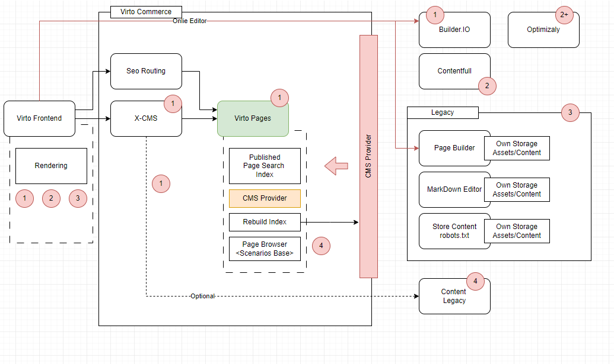

# Virto Pages Documentation

## Overview

Virto Pages is a module designed to manage and display content pages within the Virto Commerce platform. It allows you to store, search, and retrieve pages from supported Content Management Systems (CMS). The module integrates seamlessly with existing stores, enhancing their capabilities for content management.

## Features

* **Storing Content Pages**: Save pages retrieved from a CMS into the Virto platform for efficient management.
* **Page Search**: Find pages quickly using advanced search functionality.
* **Retrieve Pages by ID or Permalink**: Access pages easily using unique identifiers or user-friendly URLs.

## User Guide

To enable Virto Pages for your store, follow these steps:

1. Go to the **Stores** section in the platform.
2. Select the desired store.
3. In the **Settings** widget, navigate to the `Virto Pages` section and toggle the **Enabled** setting to "On".

Once enabled, the module will be active for that specific store, allowing you to manage pages directly.

## Module Workflow

### Under the Hood

The Virto Pages module operates through integration with your selected CMS, leveraging hooks and events to manage content updates efficiently.

- **Content Retrieval**: The integration module receives pages from the CMS through a dedicated hook, which is responsible for fetching the requested page.
- **Conversion to PageDocument**: The fetched page is then converted into a [`PageDocument`](src/VirtoCommerce.Pages.Core/Models/PageDocument.cs) model.
- **Event Handling**: The module triggers a [`PagesDomainEvent`](src/VirtoCommerce.Pages.Data/Handlers/PageChangedHandler.cs), which is processed by the pages module. During processing, the document can either be indexed for searching or removed from the index as needed.

This event-driven architecture ensures that the content in your store is always up to date and can be easily managed.

## Supported CMS Platforms

- **BuilderIO**: Fully supported for integration ([BuilderIO Documentation](link)).
- **Contentful** (coming soon).
- **Optimizely** (coming soon).

## Future Enhancements

The Virto Pages module is constantly evolving. Upcoming features include support for additional CMS platforms and enhanced search capabilities to further streamline content management.

## License

Copyright (c) Virto Solutions LTD.  All rights reserved.

Licensed under the Virto Commerce Open Software License (the "License"); you
may not use this file except in compliance with the License. You may
obtain a copy of the License at

<https://virtocommerce.com/open-source-license>

Unless required by applicable law or agreed to in writing, software
distributed under the License is distributed on an "AS IS" BASIS,
WITHOUT WARRANTIES OR CONDITIONS OF ANY KIND, either express or
implied.
