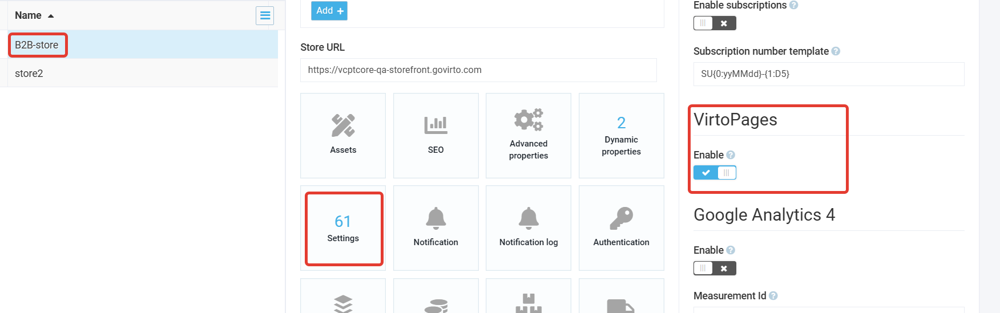

# Virto Pages

## Overview

The Virto Pages module is a solution designed to connect different CMS seamlessly within the Virto Commerce. It offers a CMS-agnostic architecture, enabling users to manage public, private, and personalized pages effectively. Once pages are published, they are stored within Virto Pages, making the CMS optional after the design phase. This approach allows for flexibility in detaching, replacing, or using multiple CMS platforms simultaneously for scenarios like landing pages, blogs, and more.

## Key Features

* **CMS-Agnostic Architecture**: CMS is required only during the design phase. Once published, content is stored in Virto Pages for use without real-time CMS dependency.
* **Hosted Content Pages**: Save pages retrieved from a CMS into the Virto platform for efficient management.
* **Content Scenarios:**
  1. **Public Pages**: Accessible to all users.
  2. **Private Pages:** Restricted to authorized users.
  3. **Personalized Pages:** Tailored content for specific user groups.
  4. **Scheduled Publishing:** Define start and end dates for content visibility.
  5. **Retrieve Pages by permalink**: Access pages easily using unique identifiers or user-friendly URLs.
  6. **Retrieve Pages by ID**: Access pages easily using unique identifiers or user-friendly URLs.
* **Full-Text Search Capabilities:** Quickly search and retrieve pages by keyword.

## Supported CMS Platforms

* **Builder.io**: Fully supported for integration.
* **Contentful**: (coming soon).
* **Optimizely**: (coming soon).
* **Virto**: Page Builder (coming soon).

## Architecture

The Virto Pages module employs an event-driven architecture to ensure efficient content management and retrieval. Key components include:

1. **Content Storage**: Pages are stored offline in an index, ensuring quick access and rendering without live CMS dependency.
2. **Event Handling**: Changes in content trigger events to update, index, or remove pages as necessary.
3. **Frontend Integration**: Pages are resolved their permalink (slug) from the offline index for rendering.
4. **Unified Page Document and API**: Unified Page Document and API allow access to pages that are created by different CMS.

Scenarios:

1.**Design Time**:
  * Integrate with a CMS to create and design pages.
  * Configure and prepare content for publishing.
2. **Publishing**:
  * Publish pages to store them in Virto Pages.
  * CMS is no longer required post-publishing.
3. **Rendering**:
  * Pages are accessed and rendered via their permalink or unique ID.
  * Content is served from offline storage for fast and reliable performance.
  * Customer can search pages by keyword.

## User Guide

To enable Virto Pages for your store, follow these steps:

1. Go to the **Stores** section in the platform.
2. Select the desired store.
3. In the **Settings** widget, navigate to the `Virto Pages` section and toggle the **Enabled** setting to "On".

Once enabled, the module will be active for that specific store, allowing you to manage pages directly.

## Module Workflow

### Under the Hood

The Virto Pages module operates through integration with your selected CMS, leveraging hooks and events to manage content updates efficiently.

- **Content Retrieval**: The integration module receives pages from the CMS through a dedicated hook, which is responsible for fetching the requested page.
- **Conversion to PageDocument**: The fetched page is then converted into a [`PageDocument`](src/VirtoCommerce.Pages.Core/Models/PageDocument.cs) model.
- **Event Handling**: The module triggers a [`PagesDomainEvent`](src/VirtoCommerce.Pages.Data/Handlers/PageChangedHandler.cs), which is processed by the pages module. During processing, the document can either be indexed for searching or removed from the index as needed.

This event-driven architecture ensures that the content in your store is always up to date and can be easily managed.

## License
Copyright (c) Virto Solutions LTD.  All rights reserved.

This software is licensed under the Virto Commerce Open Software License (the "License"); you
may not use this file except in compliance with the License. You may
obtain a copy of the License at http://virtocommerce.com/opensourcelicense.

Unless required by the applicable law or agreed to in written form, the software
distributed under the License is provided on an "AS IS" BASIS,
WITHOUT WARRANTIES OR CONDITIONS OF ANY KIND, either express or
implied.

